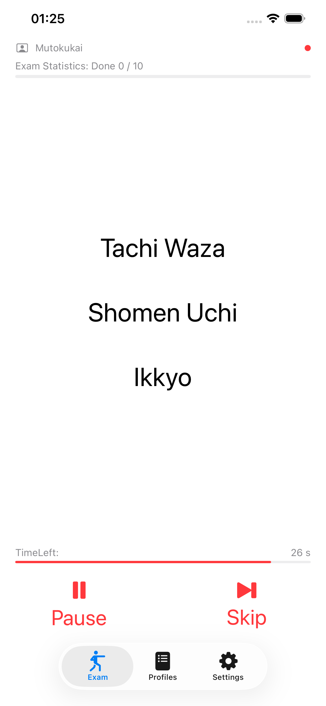
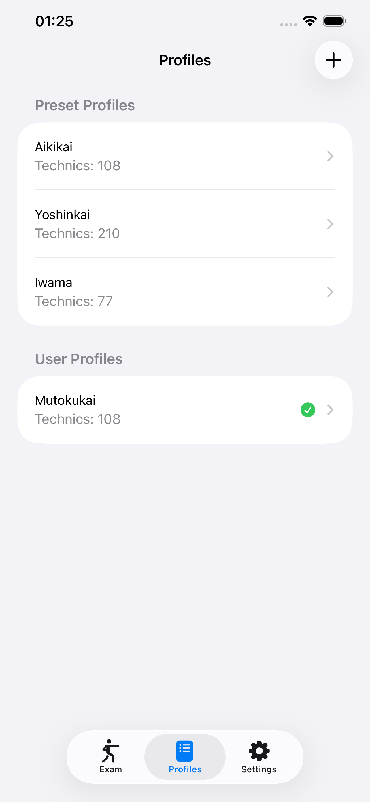
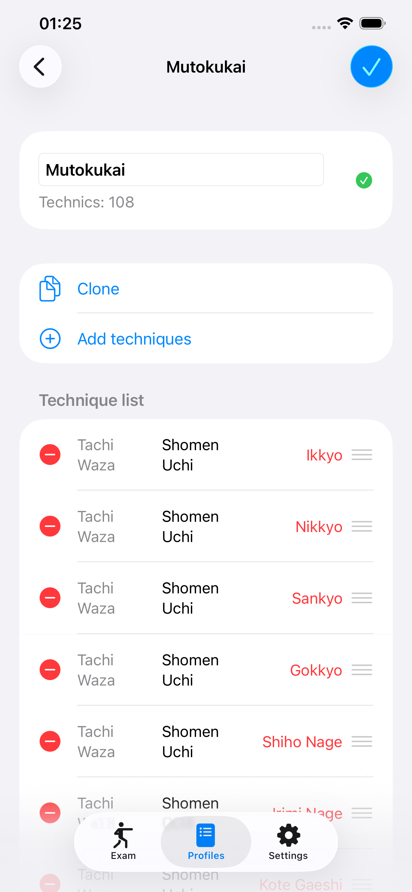
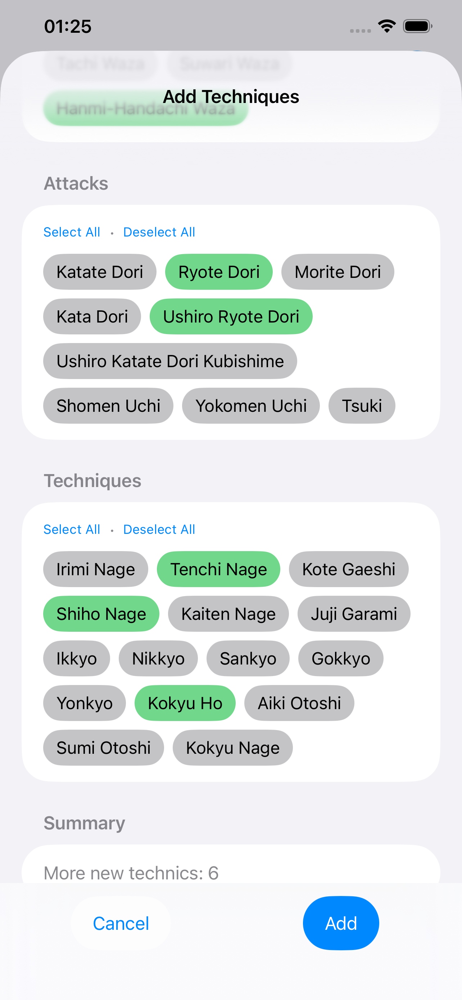
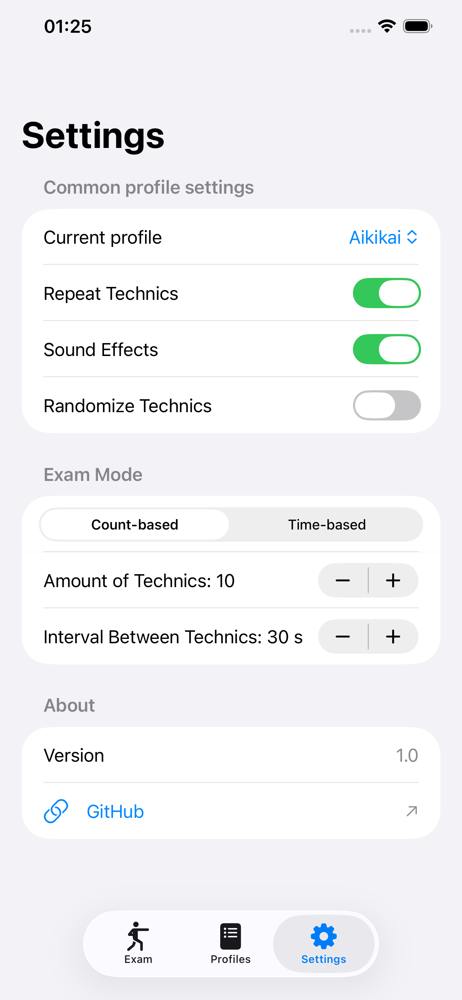

# I Wanna Aikido Exam

Practice and exam helper for Aikido practitioners.

## What it does
- Presents Aikido techniques (position + attack + technique) one at a time
- Supports count-based and time-based exam modes
- Configurable interval between techniques
- No-repeat mode ensures each technique appears only once per session
- Multiple profiles (OOTB presets + fully customisable)
- Gong sound at each technique change

## Requirements
iOS 17+, Xcode 15+

## Features
| Feature | Description |
|---|---|
| Profiles | Pre-built belt-level profiles or create your own |
| Randomize | Random or sequential technique order |
| Repeat control | Allow or block technique repetition |
| Skip | Jump to the next technique (safety-aware in no-repeat mode) |
| Sound | Optional gong at each advance |

## Screenshots

Main:

  

Profiles:

  
  
  

Settings:

  

